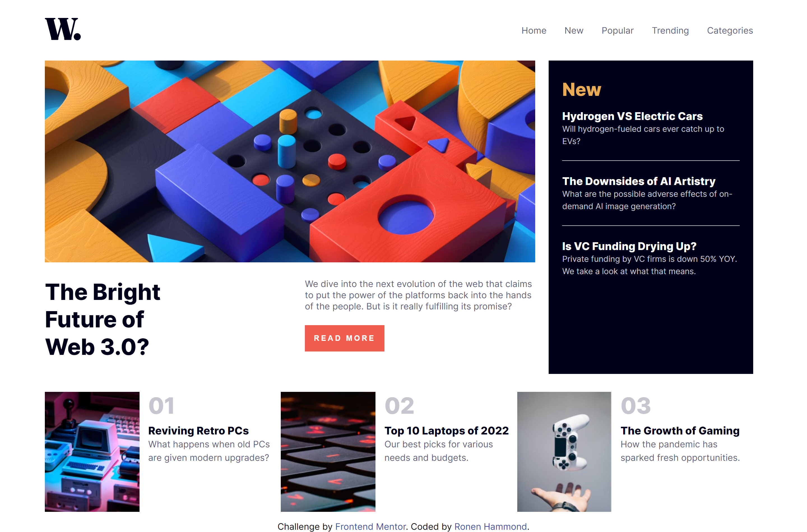
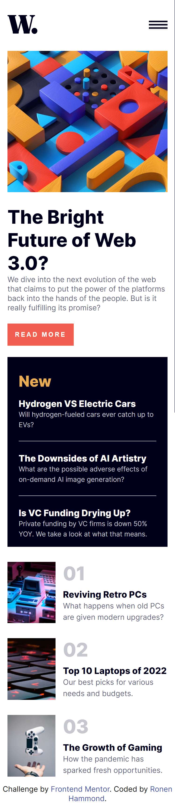

# Frontend Mentor - News homepage solution

This is a solution to the [News homepage challenge on Frontend Mentor](https://www.frontendmentor.io/challenges/news-homepage-H6SWTa1MFl). Frontend Mentor challenges help you improve your coding skills by building realistic projects.

## Table of contents

- [Frontend Mentor - News homepage solution](#frontend-mentor---news-homepage-solution)
  - [Table of contents](#table-of-contents)
  - [Overview](#overview)
    - [The challenge](#the-challenge)
    - [Screenshot](#screenshot)
    - [Links](#links)
  - [My process](#my-process)
    - [Built with](#built-with)
    - [Continued development](#continued-development)
    - [Useful resources](#useful-resources)
  - [Author](#author)
  - [Acknowledgments](#acknowledgments)

## Overview

### The challenge

Users should be able to:

- View the optimal layout for the interface depending on their device's screen size
- See hover and focus states for all interactive elements on the page

### Screenshot

### Links

- Solution URL: [Solution URL here](https://www.frontendmentor.io/solutions/news-homepage-4YNJ7_auVz)
- Live Site URL: [Live site URL here](https://ronennewshomepage.vercel.app/)

## My process

### Built with

- Semantic HTML5 markup
- CSS Grid
- [React](https://reactjs.org/) - JS library

### Continued development

Creating more projects with React.

### Useful resources

- [Components and Props](https://reactjs.org/docs/components-and-props.html) - Used it to reference props.

## Author

- Website - [Add your name here](https://ronenhammond.netlify.app/)
- Frontend Mentor - [@yourusername](https://www.frontendmentor.io/profile/RonenTGreat)
- Twitter - [@yourusername](https://twitter.com/Ronen_T_G)

## Acknowledgments

W3 Schools for helping me with the side navbar.
